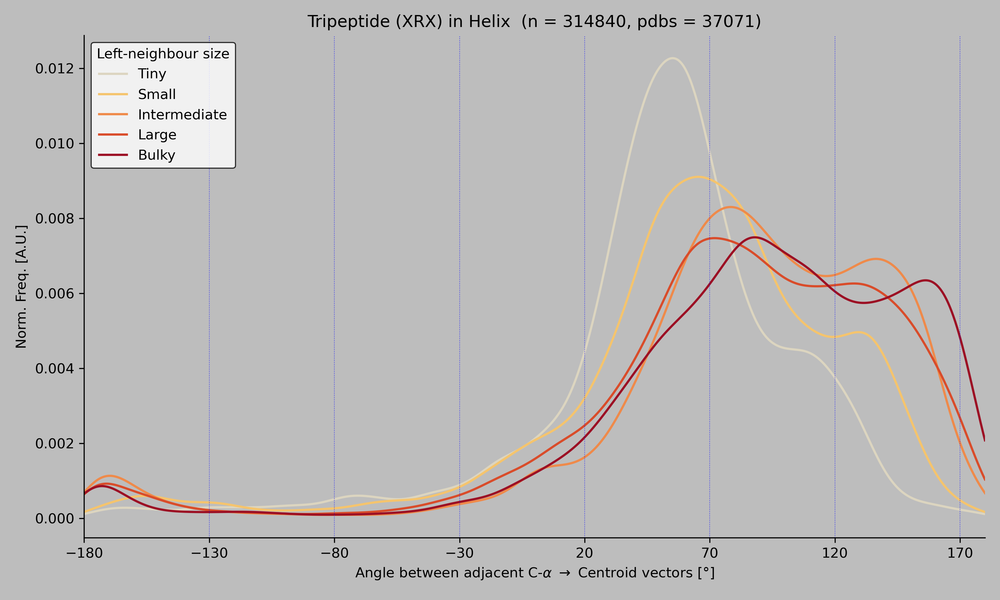

# BET-105

Snakemake pipeline for the assignment. Takes a folder of `.pdb.gz`
files, runs STRIDE on each, picks out every **HHH XRX** tripeptide
where the centre residue is arginine, and computes the signed angle
between adjacent C-α → side-chain centroid vectors. Plots the
result.

## Plot



PDB IDs that contributed to the plot:
[`results/valid_pdbs.txt`](results/valid_pdbs.txt)

## Run

Place `.pdb.gz` files inside a `pdbs/` folder at the repo root, then:

```bash
snakemake --cores 8
```

The plot is written to
`results/ss_profile_HHH_for_arg_with_valid_runs.png`.

The conda environment with snakemake, stride and the python deps is in
`environment.yml`:

```bash
conda env create -f environment.yml
conda activate bet-Shubh_Garg
```
